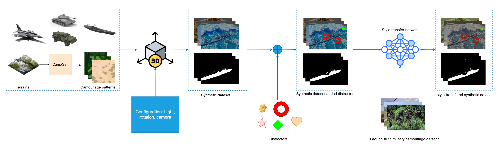
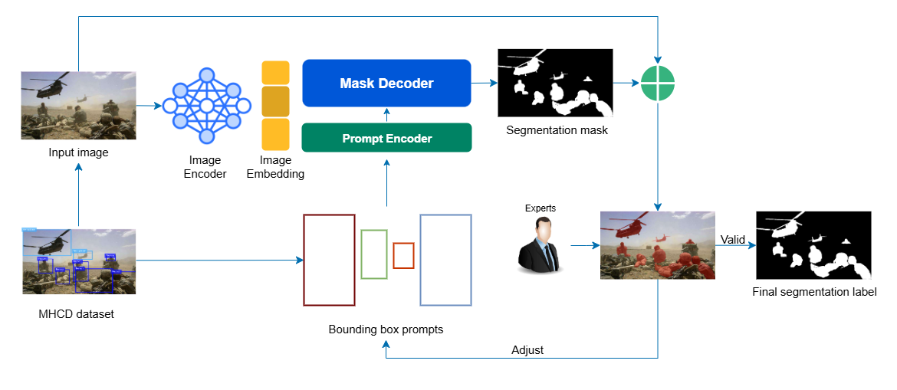

# 3DSMCOS: 3D Model-Based Synthetic Data Pipeline for Camouflaged Object Segmentation
3DSMCOS is a research project and codebase for generating high-quality synthetic training data and annotations to improve military camouflaged object detection and segmentation. This repository accompanies the paper "3DSMCOS: A 3D Model-Based Synthetic Data Pipeline for Military Camouflaged Object Segmentation with Distractor-Augmented Realism." The project aims to tackle the challenges of detecting well-camouflaged military targets by creating synthetic images with pixel-level labels and automating the labeling of real data. By addressing data scarcity, class imbalance, and the need for precise masks, 3DSMCOS helps vision models better spot camouflaged personnel and equipment in cluttered scenes.

## Motivation and Overview
Camouflaged object detection in military contexts is difficult because targets blend into complex backgrounds, and annotated datasets are limited. Existing military camouflage datasets like MHCD2022 provide only bounding boxes for training detectors, which is insufficient for segmentation tasks requiring exact object boundaries. 3DSMCOS tackles these gaps with two main components:
 - A synthetic data generation pipeline: We leverage 3D military asset models to render new training images with realistic backgrounds and distractor objects, plus style-transfer for realism. This yields abundant labeled data including pixel-wise segmentation masks.
 - An automated annotation pipeline: We introduce SAMMCOS, which uses a prompt-based segmentation model (SAM) to convert existing bounding box labels into accurate pixel masks. This produces MHCD-Seg, a new version of the MHCD dataset with pixel-level annotations.
By augmenting real data with synthetic images and auto-generated masks, 3DSMCOS significantly improves camouflaged object detection and segmentation performance on challenging military scenes. The sections below describe the provided datasets, key contributions, pipeline details, usage, and references.

## Datasets and Downloads
We provide two primary datasets in this repository (download links below):
 - MHCD-Seg – Pixel-Level Military Camouflage Dataset. This is an extension of the MHCD2022 real-world dataset. It contains the 3,000 images from MHCD (five classes: concealed soldier, vehicle, tank, aeroplane, warship) now with precise segmentation masks for each camouflaged object. The masks were generated by our SAMMCOS pipeline using the original bounding box labels as prompts, followed by expert refinement. MHCD-Seg is split into 2,400 training and 600 test images, mirroring the original MHCD split. This dataset enables training and evaluating segmentation models on real camouflage scenes with ground-truth masks. Download: [MHCD-Seg Dataset](https://drive.google.com/file/d/1NK8nxM626adBSGXAaUstaQpnGTIltQae)
- BlenderProc-Segment-Dataset – Synthetic Camouflaged Object Segmentation Dataset. A large collection of synthetic images with pixel-level annotations created by our 3DSMCOS pipeline. We rendered 3D models of military assets (tanks, vehicles, aircraft, and ships) in diverse 3D environments using BlenderProc, then added random “distractor” objects (e.g. rocks, debris) to increase clutter. Finally, we applied a style transfer (HierarchyFlow method) to make the synthetic images resemble real-world camera characteristics. The resulting dataset (dubbed “Syn3D+Distractors+ST”) contains thousands of images with corresponding segmentation masks for each target instance. These synthetic masks are exact by design, and distractors are labeled as background. This dataset addresses class imbalance by providing extra training data for under-represented classes (e.g. tanks, warships). Download: [BlenderProc-Segment Dataset](https://drive.google.com/file/d/1LLLMFZNZB44neZr9mrV15wlncBDe7vay)
Usage: Both datasets are organized with images and annotation masks. After downloading, place the files in the datasets/ directory (or update paths in the config). The MHCD-Seg set can directly train segmentation models, and the BlenderProc synthetic set can be used for data augmentation (e.g. combine with real data). Please refer to the paper for dataset details and ensure compliance with the original MHCD dataset license if applicable.

## Key Contributions
This work makes several key contributions to camouflaged object segmentation research:
 - 3DSMCOS Synthetic Data Pipeline: A novel pipeline to generate photorealistic synthetic camouflage images using 3D models of military targets. We integrate distractor objects into scenes to mimic clutter and guide model attention, and apply style transfer for domain realism. The pipeline produces pixel-accurate segmentation masks along with each image, under diverse environments and conditions.
 - SAMMCOS Automated Mask Annotation: An automated method leveraging the Segment Anything Model (SAM) for mask generation. Given an input image and its bounding-box annotation, SAMMCOS produces a high-quality segmentation mask for the camouflaged object. We use this to create MHCD-Seg, a pixel-level annotated version of the MHCD2022 dataset, dramatically reducing manual labeling effort.

## 3DSMCOS Synthetic Data Pipeline
The 3DSMCOS pipeline (diagrammed below) generates new training images that closely simulate operational environments where targets are camouflaged: Figure: Overview of the 3DSMCOS synthetic image generation pipeline. Camouflaged 3D models (tanks, ships, aircraft, etc.) are placed on random terrain backgrounds and rendered under varied configurations (lighting, camera angles) to create a base synthetic dataset (Syn3D). “Distractor” objects are then added to each scene to produce cluttered, realistic environments (Syn3D+Distractors). Finally, a neural style transfer network (HierarchyFlow) adapts the synthetic images to the visual style of real camouflage data, yielding the final Syn3D+Distractors+ST dataset. Each synthetic image comes with a perfect ground-truth mask (green overlay) for the camouflaged object, while distractors are labeled as background.
<p align="center">
  
</p>

## SAMMCOS: Auto-Labeling MHCD with Segment Anything
To complement the synthetic data, we create MHCD-Seg by automatically generating segmentation masks for the real MHCD images using our SAMMCOS pipeline. SAMMCOS stands for Segment Anything Model for Military Camouflaged Object Segmentation. It capitalizes on Meta AI's Segment Anything (SAM) model – a general segmentation network that can produce object masks given a prompt (e.g. a box or point). Process: For each image in the MHCD dataset, we take the available bounding box annotation of the camouflaged object and use that box as the prompt to SAM. SAM’s powerful prompt-driven mask decoder then generates a segmentation mask for the object within that box. We found that SAM could usually capture the object’s shape well, but in some cases of extreme camouflage, manual adjustment was needed. We implemented an iterative refinement step: a human expert reviews SAM’s mask overlaid on the image. If the mask is inaccurate, the expert tweaks the prompt (e.g. splits a bounding box or enlarges it) and SAM is run again, repeating as necessary until the mask precisely outlines the object. This process typically converges in 2–4 iterations and ensures high-quality labels without fully manual drawing.
<p align="center">
  
</p>
MHCD-Seg Dataset: Using SAMMCOS, we produced segmentation masks for all 3,000 images of MHCD. Figure 4 below shows examples of real camouflaged images from MHCD alongside the generated masks: Figure: Sample results from MHCD-Seg. Left: original images from the MHCD military camouflage dataset (soldiers and vehicles hidden in complex backgrounds). Right: the SAMMCOS-generated segmentation masks for the camouflaged objects (shown in red). Our pipeline accurately delineates low-contrast targets that were originally only bounding-box labeled, creating a valuable training resource for segmentation models. The MHCD-Seg labels now enable segmentation-model training and evaluation on this domain. We use MHCD-Seg as the primary real-data training set in our experiments, in combination with synthetic data for data augmentation.

## <a name="CitingMHCDSeg"></a>Citing MHCD-Seg
If you find our dataset helpful for your research, please consider citing the following BibTeX entry.
```BibTeX
@misc{truong2025_3dsmcos,
  title     = {3DSMCOS: A 3D Model-Based Synthetic Data Pipeline for Military Camouflaged Object Segmentation with Distractor-Augmented Realism},
  author    = {Thi-Thu-Hang Truong and Trung-Kien Tran and Ngoc-Bach Hoang and Trong-Dat Nguyen and Thi-Hai-Hong Phan and Chi-Thanh Nguyen},
  note      = {To appear in the 2025 International Conference on Multimedia Analysis and Pattern Recognition (MAPR)},
  year      = {2025},
  month     = {August}
}
```

## Acknowledgement

Many thanks to these excellent opensource projects 
* [MHCD2022](https://github.com/liumaozhen-lmz/Military-Camouflage-MHCD2022)
* [BlenderProc](https://github.com/DLR-RM/BlenderProc)
